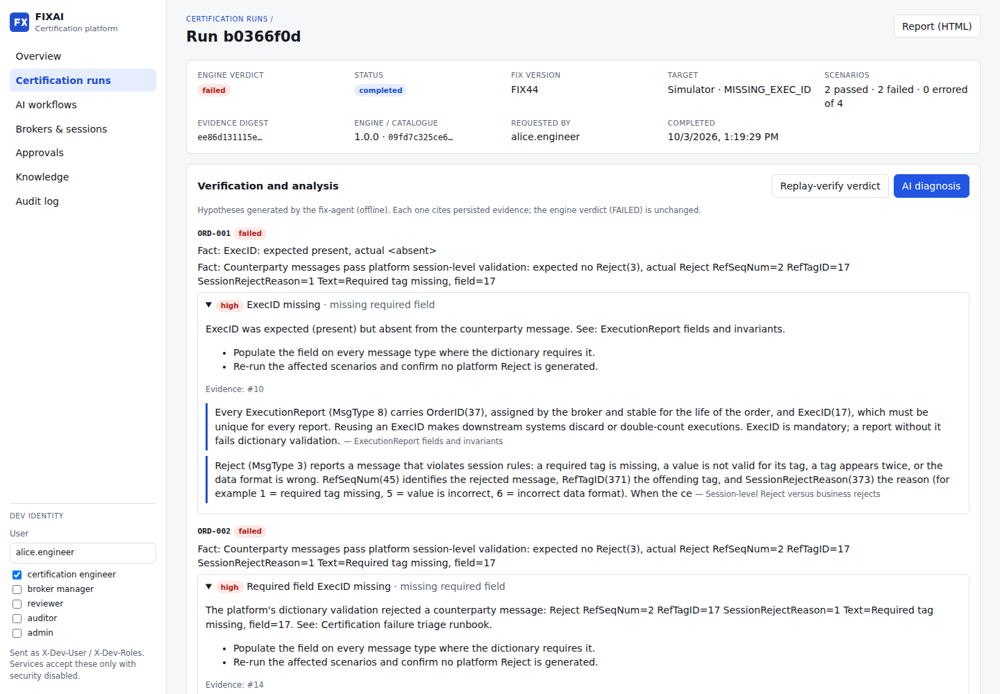
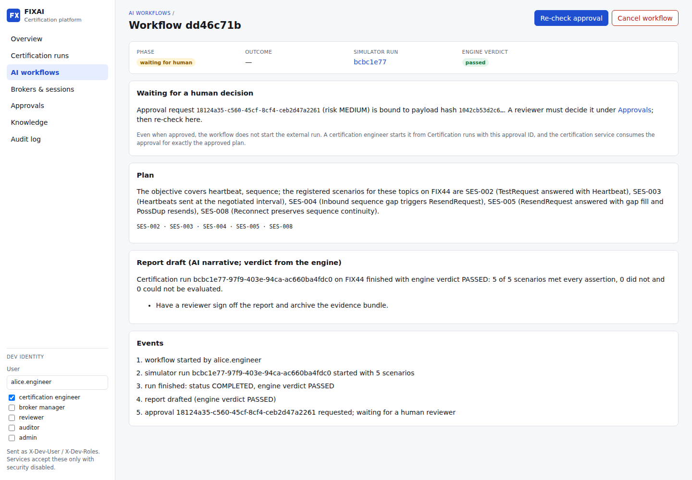

# fixai-platform

FIX certification platform for brokers and banks. A deterministic certification engine decides pass/fail from executable assertions over persisted evidence. Around it sit governed AI agents that plan runs, diagnose failures, analyse logs, answer questions with citations and draft reports. Every privileged action is behind human approval.

Built with Java 21, Spring Boot 3.5, QuickFIX/J, PostgreSQL and Flyway; Python, FastAPI, LangGraph and MCP; and React with TypeScript.

| AI diagnosis next to the engine verdict | AI workflow stopped at the human approval gate |
|---|---|
|  |  |

## Layout

| Path | Contents |
|---|---|
| `backend/fix-core` | FIX versions, dictionaries, message inspection, redaction, session spec validation |
| `backend/fix-simulator` | Deterministic FIX counterparty with 13 injectable defect profiles |
| `backend/certification-service` | Scenario DSL (24 scenarios, 4 suites), run engine, evidence, replay, reports (port 8083) |
| `backend/broker-service` | Brokers and FIX session configurations with approval-gated activation (8081) |
| `backend/workflow-service` | Payload-hash-bound approvals (four-eyes, expiry, single use) and hash-chained audit (8084) |
| `backend/platform-web` | Shared security (OIDC or dev identity), problem details, correlation IDs, audit outbox |
| `mcp/*` | MCP servers: certification (8201), fix (8202), knowledge (8203), operations (8204) |
| `ai/*` | Agents: fix (8101), certification (8102), knowledge (8103), log-analysis (8104), report (8105), human-review (8106); orchestrator (8100) |
| `evals/` | Datasets, offline platform simulation, evaluation suites, benchmarks |
| `frontend/` | React UI and nginx gateway (same-origin `/api/<service>/` routing) |
| `e2e/` | Cross-service journeys against a running stack; browser smoke tests are in `frontend/e2e` |
| `infra/` | Compose stack, container images, Prometheus/Grafana, Helm chart |
| `docs/` | Architecture, MCP tool and agent contracts, ADRs, roadmap and milestone reports |

## Quick start

```bash
# Whole platform: UI on http://localhost:3000 (dev identity switcher in the sidebar)
mvn -B package -DskipTests
docker compose -f infra/docker/docker-compose.yml --profile platform up -d --build --wait
# ...plus Prometheus (:9090) and Grafana (:3001)
docker compose -f infra/docker/docker-compose.yml --profile platform --profile observability up -d --wait
FIXAI_E2E_BASE_URL=http://localhost:3000 uv run pytest e2e          # cross-service journeys
(cd frontend && FIXAI_UI_URL=http://localhost:3000 npx playwright test)  # browser smoke
uv run python -m fixai_evals.cli benchmark --suite certification-throughput --run-suite full-certification --concurrency 4 --runs 8
```

Developer loop:

```bash
# Java services and tests (Docker is needed for Testcontainers)
mvn -B clean verify

# Postgres for running services locally
docker compose -f infra/docker/docker-compose.yml up -d

# Python workspace
uv sync --all-packages
uv run pytest
uv run ruff check ai mcp evals

# Evaluations (offline and deterministic by default; FIXAI_LLM_PROVIDER=anthropic uses Claude)
uv run python -m fixai_evals.cli run --suite agent-smoke
uv run python -m fixai_evals.cli run --suite agent-regression --split dev
uv run python -m fixai_evals.cli run --suite rag-quality
uv run python -m fixai_evals.cli run --suite safety
uv run python -m fixai_evals.cli run --suite workflow
uv run python -m fixai_evals.cli compare --baseline evals/reports/a.json --candidate evals/reports/b.json
```

## Guarantees

- **Verdicts come only from the engine.** Agents cannot change them, and narratives that contradict the verdict are rejected.
- **AI cannot approve anything or start a run against a broker endpoint.** AI-initiated runs target the synthetic simulator only.
- **Approvals bind to the exact payload.** Each approval is tied to the SHA-256 of the canonical payload, decided by a different person, and consumed once.
- **Third-party text is untrusted.** FIX field values, logs and documents are scanned, fenced and never followed as instructions.
- **Credentials never touch the platform's data.** Credentials are stored only as secret-store references; FIX credential fields are redacted from evidence and logs.
- **External runs need a human-approved plan.** A run against a broker TEST/UAT session needs a human approval of that exact plan, consumed when the run starts.

On the local stack, a full 24-scenario certification against the simulator reaches its verdict in about 10 s; see `evals/benchmarks/`.

## Documentation

- [Architecture](docs/architecture/ARCHITECTURE.md), [contracts](docs/architecture/CONTRACTS.md), [MCP tools and agents](docs/architecture/MCP_TOOLS.md), [security controls](docs/architecture/SECURITY.md)
- Kubernetes: `helm install fixai infra/helm/fixai-platform --set security.oidc.issuerUri=...` (see `values.yaml`)
- [Roadmap](docs/implementation/IMPLEMENTATION_ROADMAP.md) and [milestone reports](docs/implementation/milestones/)
- ADRs in [`docs/adr/`](docs/adr/)
