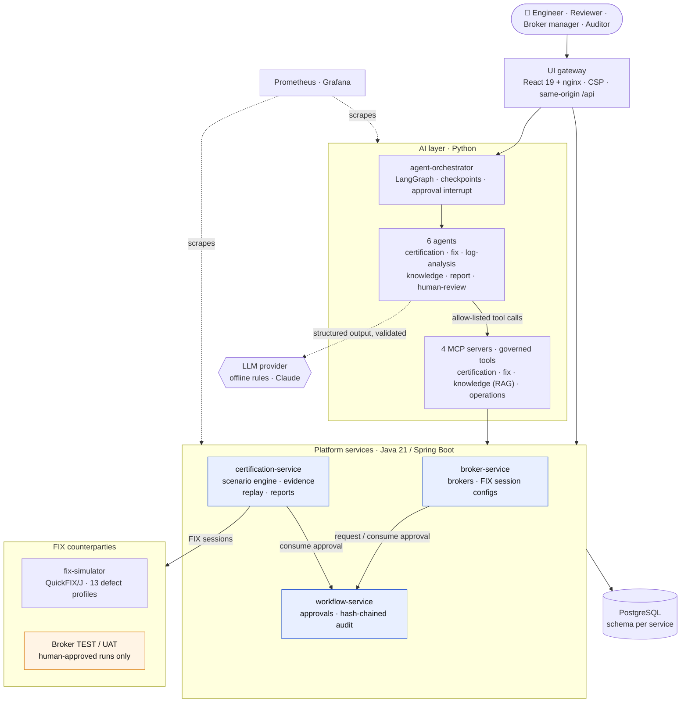
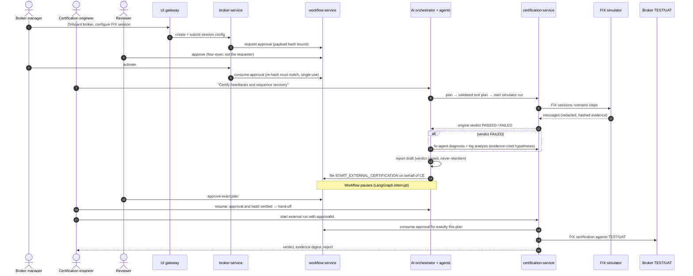
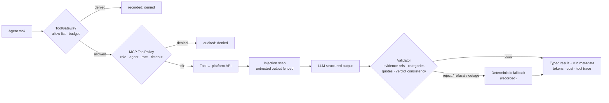
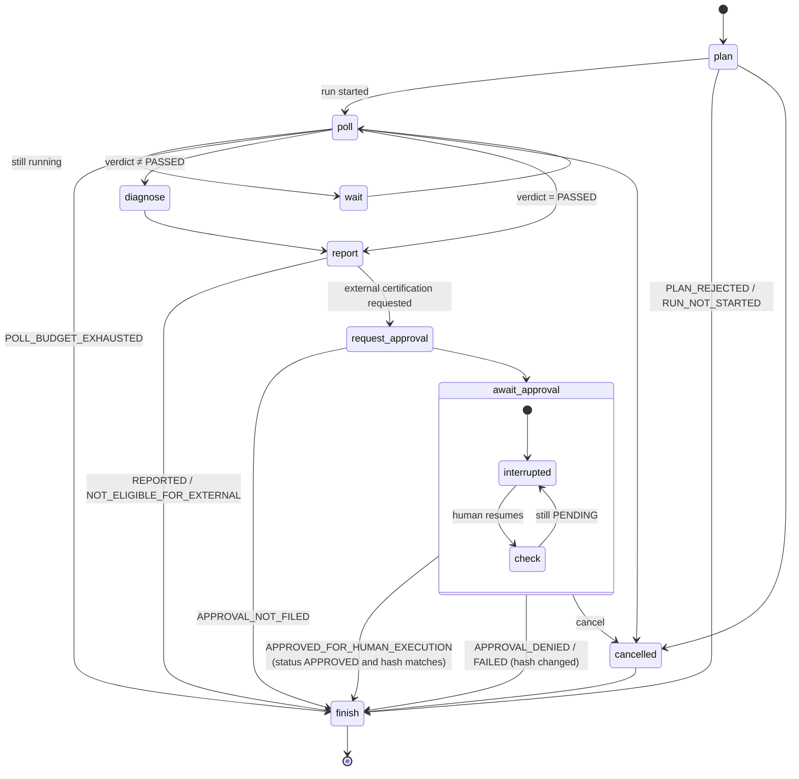
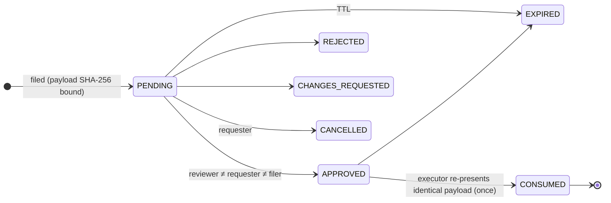

<div align="center">

# FIXAI Platform

**FIX certification in minutes, not days: a deterministic engine decides, governed AI agents assist, humans approve.**

[](https://github.com/joyrana/fixai-platform/actions/workflows/ci.yml)
[](LICENSE)


[Quick start](#-quick-start) · [Architecture](#-architecture) · [How certification flows](#-how-a-certification-flows) · [AI governance](#-ai-agents-and-governance) · [Security](#-security-guarantees) · [Docs](#-documentation)

</div>

---

FIXAI certifies broker and venue FIX connectivity for banks and brokers. It covers session logon, heartbeats, sequence recovery, the order lifecycle, rejects and boundaries across **FIX 4.2, 4.4 and 5.0 SP2**.

- **The engine decides.** A **deterministic certification engine** runs 24 scenarios against a counterparty and decides pass/fail **only** from executable assertions over persisted, redacted, hash-chained evidence.
- **AI assists.** **Governed AI agents** plan runs, diagnose failures, analyse session logs, answer questions with verified citations and draft reports, but they **can never change a verdict, approve anything, or reach a real broker**.
- **Humans approve.** Every privileged action (activating a broker session, running against a broker's TEST/UAT endpoint) needs **four-eyes approval bound to the exact payload hash**.

| AI diagnosis next to the engine verdict | AI workflow stopped at the human approval gate |
|---|---|
|  |  |

## ✨ Highlights

| | |
|---|---|
| ⚡ **Fast** | A full 24-scenario certification reaches its verdict in **~10 s** against the simulator; ~585 scenarios/min at concurrency 4 ([benchmarks](evals/benchmarks/)) |
| 🧪 **Deterministic and replayable** | Each verdict can be re-derived offline from stored evidence; per-message SHA-256 and a run-level evidence digest |
| 🎭 **Built-in counterparty** | QuickFIX/J simulator with **13 injectable defect profiles** (missing ExecID, gap-fill without flag, slow ack, …) |
| 🤖 **Six specialised agents** | Each has its own MCP tool allow-list, call budget, output validator and deterministic fallback |
| 🛡️ **Human-in-the-loop** | Approvals bound to the payload hash, four-eyes, expiry, single use; hash-chained, append-only audit log |
| 📏 **Measured AI** | 261 labelled eval cases with dev/test splits, adversarial slices, Wilson CIs, safety probes and RAG metrics |
| 🔭 **Observable** | Prometheus metrics (verdicts, latency, agent fallbacks, tokens, cost, injection findings), alert rules, Grafana dashboard |
| ☸️ **Deployable** | Compose for local, hardened Helm chart (non-root, read-only FS, default-deny NetworkPolicies) |

## 🚀 Quick start

Prerequisites: **Java 21, Maven 3.9+, Docker with Compose v2, Node.js 22.** `setup.sh` installs [`uv`](https://docs.astral.sh/uv/) if it is missing.

```bash
./setup.sh      # install all packages (Maven, uv, npm) and build every container image  (--with-tests: run all suites)
./start.sh      # run the entire platform and wait until every service is healthy     (--no-observability)
./stop.sh       # stop everything, data kept                                           (--clean: delete volumes)
```

| Service | URL |
|---|---|
| **UI** | http://localhost:3000. Pick a role in the sidebar's *dev identity* panel |
| Orchestrator API | http://localhost:8100/docs |
| Certification API | http://localhost:8083/swagger-ui.html |
| Grafana / Prometheus | http://localhost:3001 / http://localhost:9090 |

> [!NOTE]
> The local stack is for development only: security is off (development identity headers) and every port is bound to `127.0.0.1`. Behind a TLS-intercepting corporate proxy, run `CORP_CA_FILE=/path/to/ca.pem ./setup.sh`; the CA is a build secret and never ends up in an image.

**A first certification in the UI:** **Certification runs → New run**. Pick the *smoke* suite and simulator profile `MISSING_EXEC_ID`, then start the run. Watch the engine return `FAILED`, open a scenario to see the redacted evidence, then click **AI diagnosis**.

## 🏗 Architecture



| Layer | Components | Responsibility |
|---|---|---|
| **Engine** | `certification-service`, `fix-core`, `fix-simulator` | YAML scenario DSL, QuickFIX/J transport, assertion evaluation, evidence capture with redaction, replay verification, JSON/HTML reports |
| **Onboarding** | `broker-service` | Brokers and FIX session configs (TEST/UAT only, secret references only), approval-gated activation |
| **Governance** | `workflow-service`, `platform-web` | Payload-hash approvals, four-eyes, expiry, single use; append-only hash-chained audit; OIDC/RBAC, correlation IDs, audit outbox |
| **AI** | `ai/*`, `mcp/*` | LangGraph orchestrator, six agents, four MCP servers with role, agent allow-list, rate-limit, timeout and audit policies |
| **Quality** | `evals/`, `e2e/`, `frontend/e2e` | Offline evals (levels A–E), cross-service journeys, Playwright browser smoke, benchmarks |
| **Ops** | `infra/` | Compose stack, container images, Prometheus/Grafana, Helm chart |

## 🔁 How a certification flows

The external-certification journey, from broker onboarding to a certified TEST/UAT session:



## 🤖 AI agents and governance

| Agent | What the model may do | What code guarantees |
|---|---|---|
| **certification-agent** | Add relevant scenarios, explain the plan | Catalogue IDs only; plan validated by the engine; runs **simulator only** |
| **fix-agent** | Explain ranked root-cause hypotheses | Categories from deterministic triage; every evidence reference must exist |
| **log-analysis-agent** | Summarise anomalies | 14 deterministic protocol rules with log references; no verdict claims |
| **knowledge-agent** | Compose an answer | Quotes must appear verbatim in retrieved passages and pass a server check, otherwise it abstains |
| **report-agent** | Write the executive summary | Verdict, counts and digest filled by code; contradicting narratives rejected |
| **human-review-agent** | Write the reviewer packet | Policy checks before filing; **has no way to approve** |

Every model call follows the same governed path:



The orchestrator is a checkpointed LangGraph state machine with bounded polling, cancellation and a human approval interrupt:



## 🛡 Security guarantees



- **Verdicts come only from the engine.** Agents cannot change them, and narratives that contradict the verdict are rejected.
- **AI cannot approve anything or reach a broker.** AI-initiated runs target the synthetic simulator only, and the certification tool has no target parameter.
- **External runs need a human-approved plan.** The approval is bound to that exact plan and consumed when the run starts.
- **Approvals bind to the exact payload.** They are tied to the SHA-256 of the canonical payload, need four-eyes review, expire, and are consumed once. Agent-filed requests keep four-eyes on the human who asked.
- **Third-party text is untrusted.** FIX field values, logs and documents are scanned, fenced and never followed as instructions.
- **No credentials in data or logs.** Credentials are stored only as secret-store references; credential FIX tags are redacted from evidence and logs.
- **No production.** TEST/UAT only, enforced by enum and DB constraint; approval policy blocks PRODUCTION.

See [SECURITY.md](docs/architecture/SECURITY.md) for the full control matrix (19 controls, where each is enforced, which test exercises it) and the residual risks.

## 📊 Quality and evaluation

| Suite | What it measures |
|---|---|
| `agent-smoke`, `agent-regression` | Per-agent task success on labelled datasets (dev/test split, Wilson 95% CI) |
| `safety` | Governance probes and every adversarial case across all agents |
| `rag-quality` | recall@k and MRR per retrieval mode, ACL leakage, quarantine |
| `workflow` | 14 end-to-end orchestrator scenarios (approval, rejection, tampering, cancellation, restart durability) |
| `benchmark` | Time to verdict and throughput against a running stack |

```bash
uv run python -m fixai_evals.cli run --suite agent-regression --split dev
uv run python -m fixai_evals.cli run --suite safety
uv run python -m fixai_evals.cli compare --baseline evals/reports/a.json --candidate evals/reports/b.json
```

> [!IMPORTANT]
> Published scores use the deterministic **offline** provider, which measures the rules, retrieval and guardrails, not an LLM. Set `FIXAI_LLM_PROVIDER=anthropic` to evaluate Claude behind the same validators. Limitations are documented in the [M6–M10 report](docs/implementation/milestones/M6-M10-ai-layer.md).

## 🧑‍💻 Development

<details>
<summary><b>Developer loop</b></summary>

```bash
mvn -B clean verify                                  # Java services + tests (Testcontainers needs Docker)
docker compose -f infra/docker/docker-compose.yml up -d   # Postgres only, run services from the IDE
uv sync --all-packages && uv run pytest && uv run ruff check ai mcp evals e2e
(cd frontend && npm ci && npm run dev)               # UI on :5173, proxied to local services

# With the platform running (./start.sh)
FIXAI_E2E_BASE_URL=http://localhost:3000 uv run pytest e2e
(cd frontend && FIXAI_UI_URL=http://localhost:3000 npx playwright test)
uv run python -m fixai_evals.cli benchmark --suite certification-throughput --run-suite full-certification --concurrency 4 --runs 8
```
</details>

<details>
<summary><b>Repository layout</b></summary>

| Path | Contents |
|---|---|
| `backend/fix-core` | FIX versions, dictionaries, message inspection, redaction, session spec validation |
| `backend/fix-simulator` | Deterministic FIX counterparty with 13 injectable defect profiles |
| `backend/certification-service` | Scenario DSL (24 scenarios, 4 suites), run engine, evidence, replay, reports (:8083) |
| `backend/broker-service` | Brokers and FIX session configurations with approval-gated activation (:8081) |
| `backend/workflow-service` | Payload-hash approvals and hash-chained audit (:8084) |
| `backend/platform-web` | Shared security (OIDC or dev identity), problem details, correlation IDs, audit outbox |
| `mcp/*` | MCP servers: certification (:8201), fix (:8202), knowledge (:8203), operations (:8204) |
| `ai/*` | Six agents and the orchestrator (:8100) |
| `evals/` | Datasets, offline platform simulation, evaluation suites, benchmarks |
| `frontend/` | React UI and nginx gateway |
| `e2e/` | Cross-service journeys against a running stack |
| `infra/` | Compose, container images, Prometheus/Grafana, Helm chart |
| `docs/` | Architecture, contracts, ADRs, roadmap and milestone reports |
</details>

<details>
<summary><b>Kubernetes</b></summary>

```bash
helm install fixai infra/helm/fixai-platform \
  --set security.oidc.issuerUri=https://idp.example.com/realms/fixai \
  --set ingress.enabled=true --set ingress.host=fixai.example.com
```

OIDC is on by default, and the chart refuses to render without an issuer. PostgreSQL is external and secrets are referenced by name. Pods are hardened, and default-deny NetworkPolicies give the AI tiers no route to brokers. See [`values.yaml`](infra/helm/fixai-platform/values.yaml).
</details>

## 📚 Documentation

| Topic | Link |
|---|---|
| Architecture and topology | [ARCHITECTURE.md](docs/architecture/ARCHITECTURE.md) |
| API and event contracts | [CONTRACTS.md](docs/architecture/CONTRACTS.md) |
| MCP tools and agent contracts | [MCP_TOOLS.md](docs/architecture/MCP_TOOLS.md) · [JSON contracts](docs/architecture/contracts/) |
| Security controls and threat model | [SECURITY.md](docs/architecture/SECURITY.md) |
| Architecture decisions | [docs/adr](docs/adr/) |
| Roadmap and milestone reports | [Roadmap](docs/implementation/IMPLEMENTATION_ROADMAP.md) · [Reports](docs/implementation/milestones/) |

## License

[MIT](LICENSE) © 2026 Joy Rana
