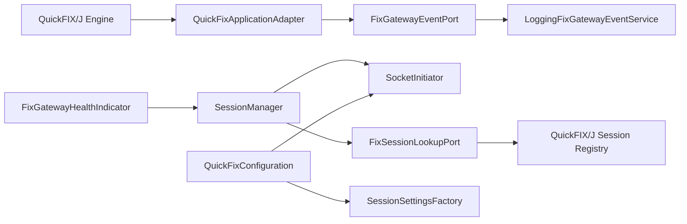
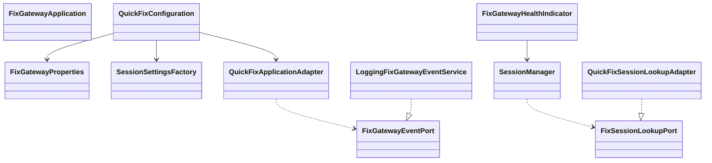
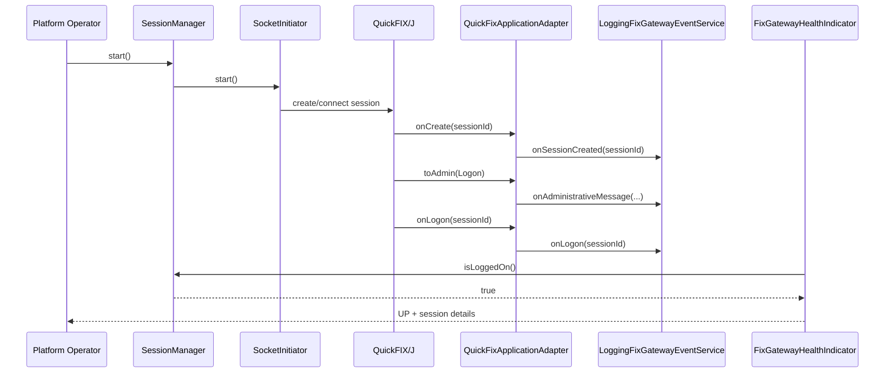

# FIX Gateway

Enterprise-grade FIX connectivity infrastructure for the FIXAI Platform, built with Spring Boot 3.5, Java 21, Maven, QuickFIX/J 2.3, Actuator, and JUnit 5.

## Local Run

Use the repository run configuration **Fix Gateway (Local)**. It starts `FixGatewayApplication` with the `local` Spring profile and uses `backend/fix-gateway` as the working directory.

The local profile is defined in `src/main/resources/application-local.yml` and points at:

- a local counterparty endpoint at `localhost:9876`
- local QuickFIX/J store and log directories under `backend/fix-gateway/var`
- a checked-in FIX 4.4 data dictionary at `src/main/resources/fix/FIX44.xml`

On startup, `FixGatewayLifecycle` automatically starts the QuickFIX/J initiator and stops it on shutdown.

## Responsibilities

- establish and manage a single outbound QuickFIX/J initiator session
- bind strongly typed Spring configuration into runtime FIX session settings
- expose lifecycle control through `SessionManager`
- log operational FIX session events through SLF4J
- publish Actuator health for platform observability

## Configuration

```yaml
fix:
  gateway:
    sender-comp-id: FIXAI
    target-comp-id: BROKER
    begin-string: FIX.4.4
    host: localhost
    port: 9876
    heartbeat-interval: 30
    reconnect-interval: 5
    store-path: /var/lib/fixai/fix/store
    log-path: /var/log/fixai/fix
    dictionary-path: /opt/fix/FIX44.xml
    reset-on-logon: true
    reset-on-logout: false
    reset-on-disconnect: true
    validate-incoming-messages: true
```

## Architecture

The module follows a hexagonal structure:

- **Inbound adapters**: QuickFIX/J application adapter and Spring Boot Actuator health indicator
- **Application layer**: session lifecycle orchestration and FIX event logging service
- **Outbound adapter**: QuickFIX/J runtime session lookup
- **Configuration layer**: dynamic QuickFIX/J session settings and engine bean construction



## Class Diagram



## Sequence Diagram



## Operational Notes

- `SessionManager` is the single lifecycle entry point for starting and stopping the gateway.
- `QuickFixApplicationAdapter` uses `MessageCracker` for typed FIX message handling.
- Unsupported or malformed admin traffic is logged and does not terminate the process.
- The module intentionally excludes broker onboarding, OMS integration, and certification workflows.
