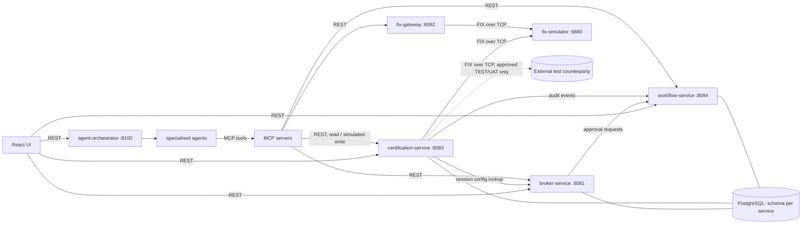
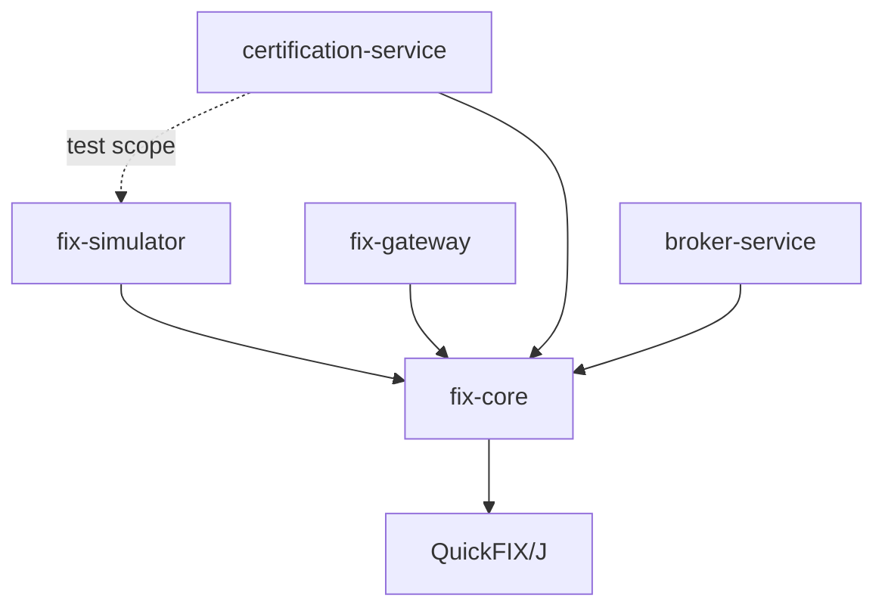
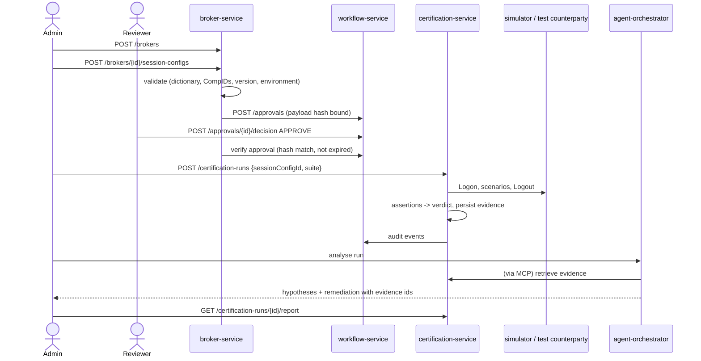

# FIXAI Platform Architecture

FIXAI certifies counterparty FIX implementations: broker FIX engines, OMS/EMS connectivity and venue gateways. It runs deterministic, executable scenarios against them and records message-level evidence. AI agents explain failures and recommend fixes, but they never decide the verdict.

The design goal is **certification in minutes instead of days**. Scenario suites run unattended in seconds against a simulator or an approved test counterparty, and failures arrive already triaged with evidence-backed explanations.

## 1. Principles

1. **Deterministic verdicts.** Pass/fail comes only from executable assertions over persisted evidence. LLM output is advisory and is labelled as a hypothesis everywhere it is displayed.
2. **Evidence first.** Every FIX message sent or received during a run is persisted, in redacted form, with its ordinal, sequence number, direction, timestamp and SHA-256 of the original bytes. Reports are rendered from this evidence only.
3. **Replayable.** A finished run can be re-evaluated offline against its stored evidence. The verdict must reproduce exactly.
4. **Safe by default.** The default counterparty is the bundled simulator with synthetic data. Connecting to anything else requires a session configuration in `TEST` or `UAT` environment that has been approved through the workflow service. `PRODUCTION` targets are rejected by the certification engine.
5. **Hexagonal services** (ADR-0002). Domain and application code depend on ports, not on QuickFIX/J, JPA or web types.
6. **No premature infrastructure.** Kafka, Redis and an API gateway are added only when a feature needs them (ADR-0006).

## 2. Runtime components

| Component | Language | Owns | Persistence |
|---|---|---|---|
| `backend/fix-core` (library) | Java | FIX versions, dictionaries, session-settings building, message inspection/validation, redaction | none |
| `backend/fix-simulator` | Java | Deterministic synthetic counterparty (acceptor) with compliant and defect profiles | in-memory |
| `backend/fix-gateway` | Java | Long-lived QuickFIX/J sessions, session state, health and diagnostics | file message store |
| `backend/broker-service` | Java | Broker profiles, FIX session configurations, configuration validation | `broker` schema |
| `backend/certification-service` | Java | Scenario catalogue, runs, assertions, evidence, replay verification, reports | `certification` schema |
| `backend/workflow-service` | Java | Approval requests and decisions, hash-chained audit log | `workflow` schema |
| `ai/*` | Python | Agent orchestration (LangGraph), specialised agents | orchestrator checkpoints |
| `mcp/*` | Python | Typed, authorised tool surface over the Java APIs | none |
| `evals/` | Python | Datasets, evaluators, benchmark CLI | run artefacts on disk |
| `frontend/react-ui` | TypeScript | Operator UI | none |

## 3. Dependency rules

- `fix-core` is the only module that defines shared FIX abstractions. Services must not depend on each other's jars; they integrate over versioned HTTP contracts.
- Within a service, `domain` depends on nothing framework-specific, `application` depends on `domain` and port interfaces, and `adapter.*` depends on the rest.
- Python agents never call each other directly. The orchestrator invokes agents over bounded HTTP calls, and agents reach platform state only through MCP tools.

## 4. End-to-end certification flow

## 5. Cross-cutting conventions

- **Correlation:** every HTTP request carries or receives `X-Correlation-Id`. It is propagated to logs (MDC), audit events and outbound calls, and it is stored on runs and approvals.
- **Idempotency:** state-creating POSTs accept `Idempotency-Key`. A replay with the same key and body returns the original response, and the same key with a different body returns `409`.
- **Errors:** RFC 7807 `application/problem+json` without stack traces.
- **Versioning:** URL major version (`/api/v1`) plus a `schemaVersion` on events and evidence.
- **Time:** UTC `Instant` everywhere; FIX `SendingTime` is excluded from deterministic comparisons.
- **Redaction:** tags 553, 554, 925, 96 and 95, plus any tag configured as sensitive, are replaced with `***` before logging or persistence. Integrity is preserved through SHA-256 of the original message.

## 6. Deployment topology (local)

`docker compose -f infra/docker/docker-compose.yml up` starts PostgreSQL, the simulator and the Java services. The AI services and UI are added as their milestones land. Kubernetes/Helm come after the local stack is stable (roadmap M13).
